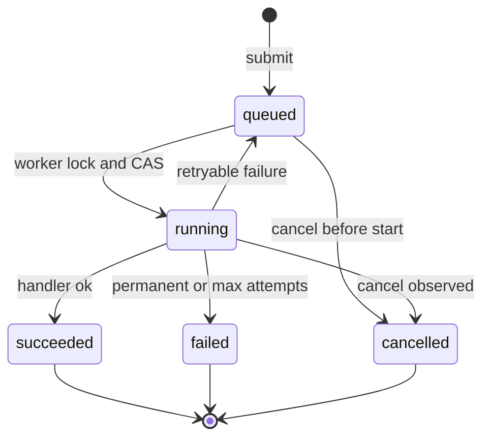
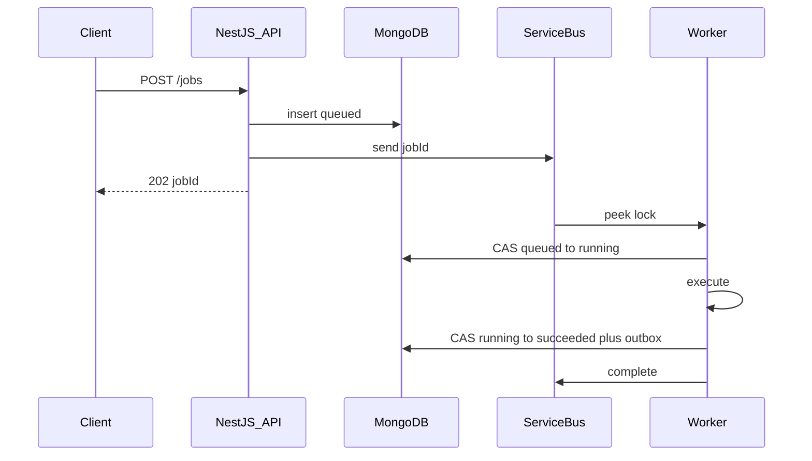
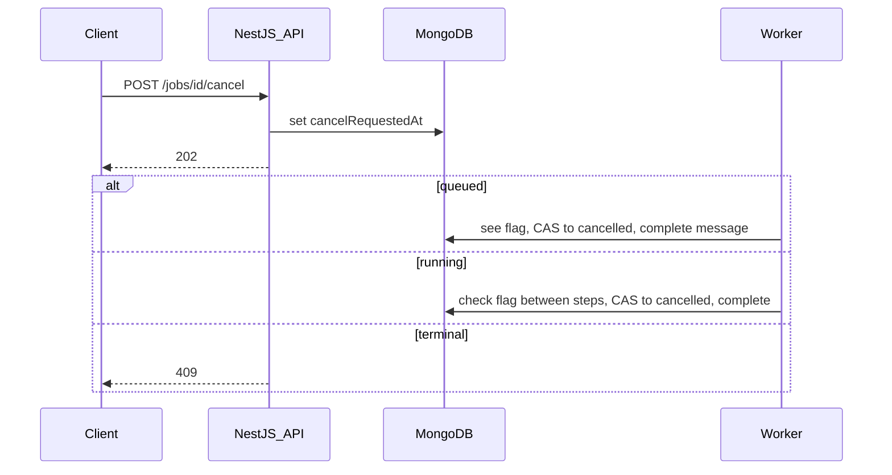

# Architecture notes

Companion to [README.md](README.md). How the three pieces actually move.

## Job state machine



- Terminal states do not leave that state.
- `running → queued` is a retry. `attempt` goes up. Backoff is a scheduled Service Bus message, not a timer in the worker.
- Updates are `findOneAndUpdate({ _id, status: expected }, { $set: { status: next } })`. Null result: someone else won; reload and stop.
- `cancelRequestedAt` is a flag. Status becomes `cancelled` only when the API (still queued) or the worker applies the transition.

## Data model

```text
jobs
  _id, tenantId, type, status
  attempt, maxAttempts
  idempotencyKey           -- unique per tenant when present
  payloadUri, resultUri
  lastError
  webhookUrl
  cancelRequestedAt
  createdAt, updatedAt, startedAt, finishedAt

outbox
  _id, jobId, payload, availableAt, attempts, deliveredAt
```

Indexes: `{ tenantId, status }`, `{ status, updatedAt }` for the sweeper, unique `{ tenantId, idempotencyKey }` when the key is set.

Service Bus message: `{ "jobId", "type", "attempt" }`. MessageId is `jobId:attempt` so a double send of the same attempt is dropped.

## API

| Method | Path | Contract |
| --- | --- | --- |
| `POST` | `/jobs` | `{ type, payload, webhookUrl?, idempotencyKey? }` → `202 { jobId, status: "queued" }`. Same idempotency key returns the original job. Over cap → `429`. |
| `GET` | `/jobs/:id` | Current document. This is status. Poll it. |
| `POST` | `/jobs/:id/cancel` | Sets `cancelRequestedAt`. `202` if `queued` or `running`. `409` if already terminal. |

Submit: insert `queued`, then send the message, then return. If the send fails, the sweeper re-enqueues `queued` jobs older than ~15s.

## Sequences

Submit and run:



Retryable failure: CAS `running` → `queued`, increment attempt, scheduled send, complete current message. Permanent or max attempts: CAS to `failed` plus outbox. Backoff `min(2^attempt, 300)` seconds plus jitter.

Cancel:



Only the worker that holds the peek-lock can complete the message. Completing after cancel matters; abandoning would redeliver a cancelled job. On lock renewal, re-read the flag.

Notify: worker writes terminal status and outbox in one transaction. Dispatcher claims the outbox document and POSTs a signed webhook. Failures retry the webhook only.

## Scaling and fairness

- KEDA on active message count, with a max replica cap.
- Per-pod cap on in-flight handlers.
- Tenant open-job count from MongoDB (`queued` + `running`). Over quota → `429`.
- Global queue-depth watermark → `429` for everyone.

## NestJS shape

One repo, two processes:

- `JobsModule` — HTTP submit / status / cancel.
- `WorkerModule` — Service Bus receiver, handler registry, lock renewal, cancel checks.
- `JobsRepository` — `findOneAndUpdate` plus outbox in one transaction.
- `NotificationModule` — outbox poller, webhook client.

```ts
interface JobContext {
  jobId: string;
  tenantId: string;
  attempt: number;
  payload: unknown;
  isCancelled(): Promise<boolean>;  // findById, read cancelRequestedAt
}
```

## Failure table

| Failure | What happens |
| --- | --- |
| API dies after insert, before enqueue | Sweeper re-enqueues `queued` jobs. |
| Worker dies mid-handler | Lock expires, message comes back. Conditional update stops a double start; a stale `running` document is returned to `queued` after a lease timeout. |
| Service Bus down | Submit fails after insert; sweeper retries. `GET /jobs/:id` still works. |
| Webhook down | Outbox retries. Job stays terminal. |
| Poison payload | Max delivery → DLQ; job `failed`. |

## Why this shape

- Running the job inside the HTTP request cannot last minutes and cannot absorb a spike.
- Using only MongoDB as the queue (a work collection you poll) works at small scale. Service Bus is there for spikes, DLQ, and scheduled retry.
- A cache or a workflow engine is a later add when status traffic or multi-step human waits actually show up.
