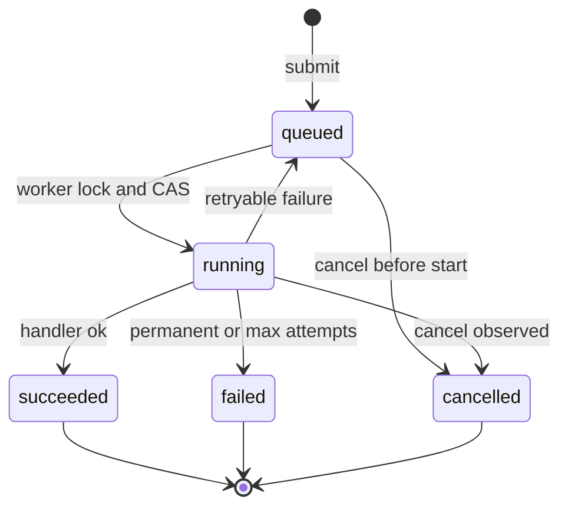
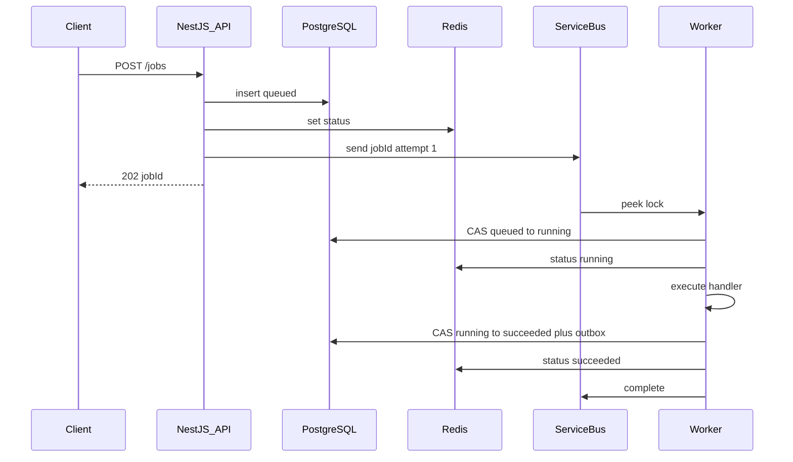
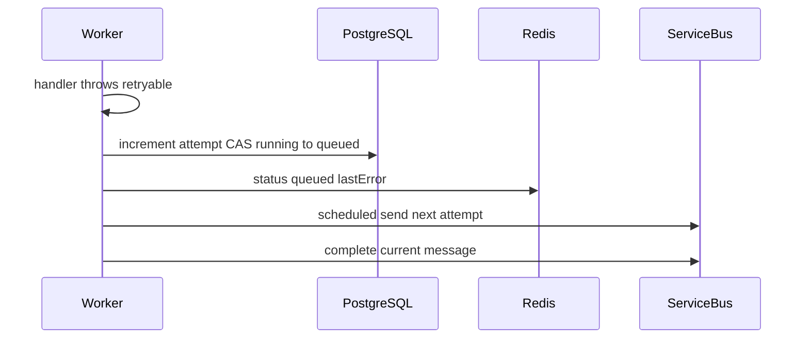
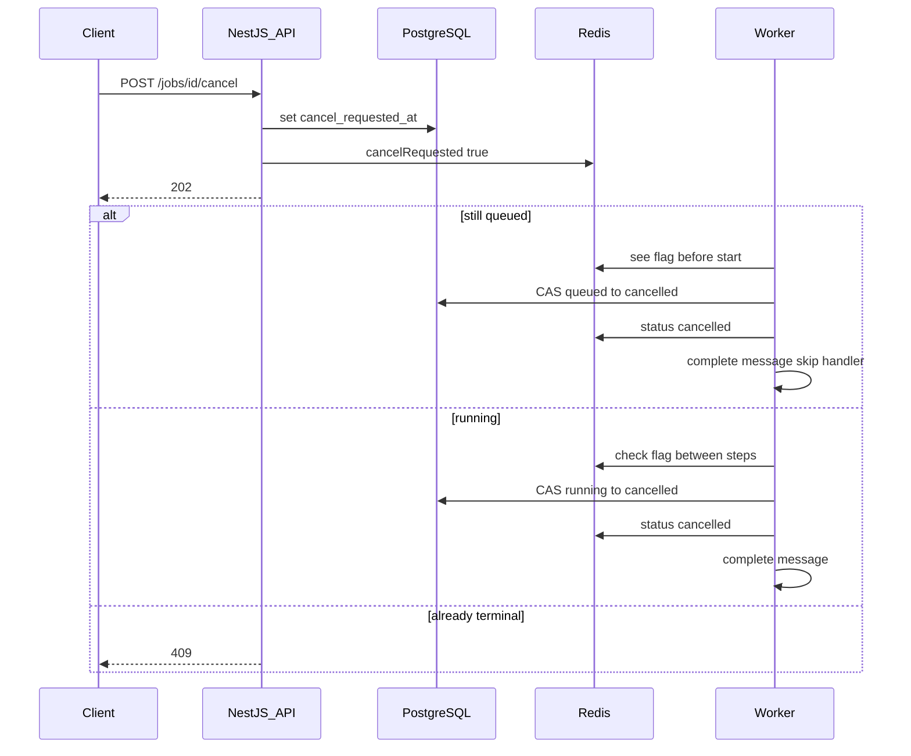
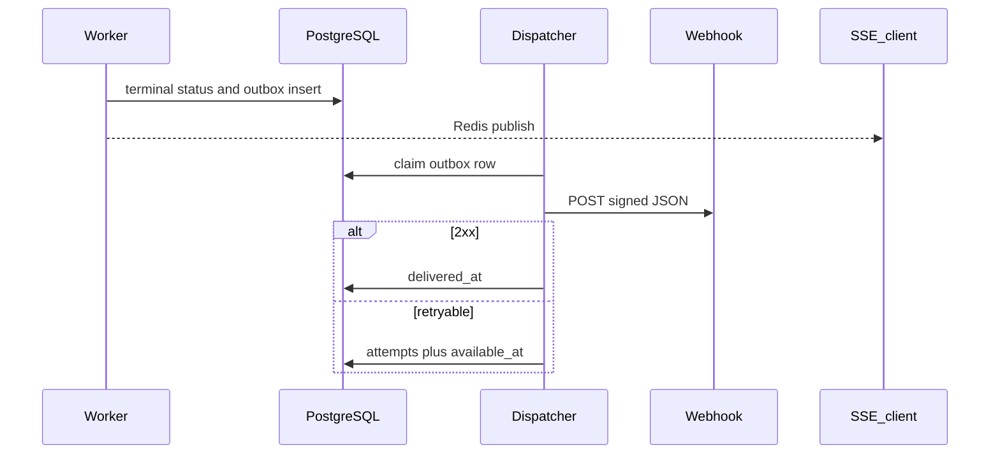

# Architecture notes

Companion to [README.md](README.md). API sketch, state machine, and the sequences that matter.

## Job state machine



Rules:

- Terminal states (`succeeded`, `failed`, `cancelled`) never leave that state.
- `running → queued` is a retry. `attempt` increments. A scheduled Service Bus message is the backoff clock, not `setTimeout` in the worker.
- Transitions use `UPDATE jobs SET status = $next WHERE id = $id AND status = $expected`. Zero rows means another actor won; the worker must reload and follow the new state (usually complete the message and stop).
- `cancel_requested_at` is a flag, not a status. Status becomes `cancelled` only after a worker or the API (for never-started jobs) applies the transition.

## Data model (sketch)

```text
jobs
  id                  uuid pk
  tenant_id           uuid not null
  type                text not null
  status              text not null
  attempt             int  not null default 0
  max_attempts        int  not null
  idempotency_key     text null
  payload_uri         text not null
  result_uri          text null
  last_error          jsonb null
  webhook_url         text null
  cancel_requested_at timestamptz null
  created_at          timestamptz not null
  updated_at          timestamptz not null
  started_at          timestamptz null
  finished_at         timestamptz null

  unique (tenant_id, idempotency_key) where idempotency_key is not null
  index (tenant_id, status, created_at)
  index (status, updated_at)  -- sweeper: stranded queued rows

job_audit
  id, job_id, from_status, to_status, actor, at, detail jsonb

outbox
  id, job_id, event_type, payload jsonb, available_at, attempts, delivered_at, last_error
```

Redis document (key `job:{id}`):

```json
{
  "id": "...",
  "tenantId": "...",
  "status": "running",
  "attempt": 1,
  "cancelRequested": false,
  "updatedAt": "2026-09-15T17:00:00Z"
}
```

Service Bus message:

```json
{
  "jobId": "...",
  "type": "extract-document",
  "attempt": 1
}
```

MessageId is `jobId:attempt` so duplicate detection drops a double enqueue of the same attempt.

## API sketch

All routes are tenant-scoped via the auth context. Bodies validated at the Nest pipe.

| Method | Path | Contract |
| --- | --- | --- |
| `POST` | `/jobs` | Body: `{ type, payload, webhookUrl?, idempotencyKey?, maxAttempts? }`. Returns `202 { jobId, status: "queued" }`. Same `Idempotency-Key` / body key returns the original job, not a second row. `429` + `Retry-After` if tenant or global admission cap is hit. |
| `GET` | `/jobs/:id` | `200` with status document. `404` if missing or other tenant. Redis first, Postgres on miss. |
| `GET` | `/jobs/:id/events` | SSE. Sends the current document immediately, then Redis pub/sub. Polling `GET` is the fallback. |
| `POST` | `/jobs/:id/cancel` | Sets the cancel flag. `202` if the job is `queued` or `running` (cancel requested). `409` if already terminal. `404` if not visible to the tenant. |

Submit internals, in order:

1. Upsert on `(tenant_id, idempotency_key)` if a key was provided.
2. Insert `jobs` at `queued`.
3. Write Redis status.
4. Send Service Bus message.
5. Return `202`.

If step 4 fails, the row stays `queued`. A sweeper (periodic Nest task or Azure Function) finds `status = queued AND cancel_requested_at IS NULL AND updated_at < now() - 15s` with no matching in-flight lock and re-enqueues. Do not delete the row on enqueue failure.

## Sequence: submit and run



If the CAS in "queued to running" matches zero rows, the worker completes the message without running the handler (already running, already terminal, or cancelled).

## Sequence: retryable failure



Permanent error or `attempt >= max_attempts`: CAS to `failed`, write outbox, complete or dead-letter according to whether we still want an operator-replay path. Business-validation failures should not sit in the DLQ; they are `failed` with a structured `last_error`. The DLQ is for poison messages and operator replay.

Backoff: `min(2^attempt, 300)` seconds plus jitter, encoded as Service Bus scheduled enqueue time.

## Sequence: cancel



The API does **not** try to complete or abandon a Service Bus message it does not hold. Only the locking worker can do that. Completing after cancel is required; abandoning would redeliver a cancelled job.

Lock renewal: if the handler runs for minutes, renew the peek-lock and re-read the cancel flag on each renewal. That is the interrupt point for long single-step work.

## Sequence: notify



Webhook body includes `jobId`, `tenantId`, `status`, `attempt`, `finishedAt`. Sign with HMAC using a per-tenant secret. Dispatcher concurrency is bounded. SSE is not retried and is not the system of record.

## Admission control and scaling

- KEDA `azure-servicebus` scaler: target outstanding messages per replica, `maxReplicaCount` set from downstream capacity (Postgres connections, handler QPS).
- Per-pod concurrency: Service Bus prefetch and a worker semaphore (e.g. 4 in-flight jobs per replica).
- Per-tenant quota: Redis counters for `queued + running` by tenant, incremented on submit, decremented on terminal. Over quota → `429`.
- Global depth cap: if the queue is past a hard watermark, every submit gets `429` regardless of tenant. Better a loud refusal than a two-hour silent backlog.

## NestJS shape

One repo, two processes, same modules:

- `JobsModule` — HTTP controllers, submit/cancel/status, admission guards.
- `WorkerModule` — Service Bus receiver, handler registry (`type → JobHandler`), lock renewal, cancel polling.
- `JobsRepository` — CAS updates, outbox insert in the same query runner / transaction.
- `StatusCache` — Redis document + pub/sub.
- `NotificationModule` — outbox poller, webhook client.

Handlers implement:

```ts
interface JobHandler {
  type: string;
  execute(ctx: JobContext): Promise<JobResult>;
}

interface JobContext {
  jobId: string;
  tenantId: string;
  attempt: number;
  payload: unknown;
  isCancelled(): Promise<boolean>;
}
```

`isCancelled()` is the cooperative interrupt. A handler that ignores it cannot be cancelled mid-execution; that is documented, not papered over.

## Failure and ops

| Failure | What happens |
| --- | --- |
| API dies after insert, before enqueue | Sweeper re-enqueues `queued` rows. |
| Worker dies mid-handler | Peek-lock expires; message redelivers; CAS prevents a second `running` if a zombie still holds the row, or a new worker starts attempt N+1 if the row was left `running` too long — a lease/`started_at` timeout returns stranded `running` jobs to `queued`. |
| Redis down | `GET` falls back to Postgres. Cancel still writes Postgres; workers check the DB flag if Redis is unavailable. SSE degrades to polling. |
| Service Bus outage | Submit fails after insert; sweeper retries. Status API still works. |
| Webhook endpoint down | Outbox retries; job stays terminal. Client can still `GET /jobs/:id`. |
| Poison payload | Max delivery → DLQ; job `failed`; page on DLQ depth. |

## Why not the other shapes

- **Run the job in the HTTP request.** Breaks the "minutes" requirement and every spike.
- **Postgres `LISTEN/NOTIFY` or a `FOR UPDATE SKIP LOCKED` queue as the primary work queue.** Fine at small scale; Service Bus is the spike absorber and gives DLQ, scheduled retry, and competing consumers without us reinventing them.
- **Temporal as v1.** Right if a job is a long workflow with human waits. This prompt is a job runner. Revisit when a handler needs durable timers, signals, or multi-step compensation as the common case.
- **Hard-kill cancel.** Looks decisive, produces duplicate side effects when the lock expires and the work actually finished.
