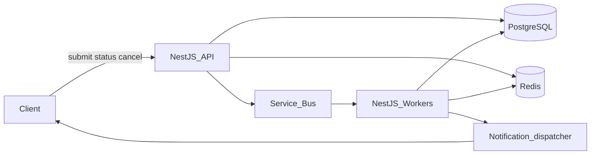

# Async job processing system

Makai Labs async technical exercise. This is an architecture write-up, not an implementation.

A product team needs to accept long-running jobs over an API (seconds to minutes), run them asynchronously, retry on failure, expose status in near real time, notify the caller on completion or failure, and occasionally cancel a job that is already running. Volume is high and spiky.

**Stack.** NestJS on Azure Kubernetes Service, Azure Service Bus as the work queue, PostgreSQL as the source of truth, Redis for the hot status/cancel path.

Deeper API sketches, the job state machine, and sequence diagrams live in [ARCHITECTURE.md](ARCHITECTURE.md).

## Assumptions

- Multi-tenant SaaS. The caller is already authenticated; every job is scoped to a tenant.
- A job is an opaque, machine-run unit of work (type, JSON payload, optional blob inputs). Human-approval gates are out of scope. If jobs later pause for a reviewer, add a workflow layer (Temporal) rather than stretching the queue.
- Processing is at-least-once. Workers must be idempotent. Exactly-once delivery is not assumed.
- Cancel is cooperative: a running worker checks a cancel flag between steps. We do not SIGKILL processes or yank a locked Service Bus message.
- Default notification is an HTTPS webhook supplied at submit time. Email and push are out of scope. The product UI can subscribe to status over SSE.
- Payloads large enough to matter live in Azure Blob Storage. The queue message is a pointer (`jobId`, `type`, `attempt`).
- Azure, AKS, NestJS, Service Bus Standard or Premium, Azure Database for PostgreSQL, Azure Cache for Redis.
- We log state transitions for audit (SOC 2 / HIPAA-shaped environments) and keep payloads and PII out of logs and traces.

## High-level architecture

The API never runs the job. It records intent, enqueues a small message, and returns. Workers compete on the queue. PostgreSQL is the system of record. Redis holds live status and the cancel flag so polls do not hit the database. Notifications come from an outbox committed in the same transaction as the terminal state, so "job succeeded" and "user was told" cannot silently diverge.

Happy path:

1. `POST /jobs` validates the request, writes a `queued` row, writes the Redis status document, enqueues `jobId` on Service Bus, returns `202` with `jobId`.
2. A worker peek-locks the message, compares-and-sets the row to `running`, executes the handler, then marks `succeeded` or routes to retry / dead-letter.
3. On a terminal state the worker writes the outbox row and updates Redis. A dispatcher delivers the webhook. SSE subscribers see the same Redis pub/sub event.

Spikes are absorbed by Service Bus. Workers autoscale on queue depth via KEDA. If depth or per-tenant in-flight work exceeds a cap, the API sheds load with `429` and `Retry-After` instead of enqueueing unbounded work.

## Major components

**Job API (NestJS, AKS).** Public surface: auth, validation, tenant authorization, submit, status, cancel. It does not execute handlers. Submit is "write row, then enqueue." If enqueue fails after insert, a sweeper re-enqueues stale `queued` rows so jobs are not stranded.

**Job store (PostgreSQL).** Source of truth: one row per job (ids, type, status, attempts, payload/result URIs, error, cancel flag, webhook, timestamps). Status is a state machine (`queued → running → succeeded | failed | cancelled`). Transitions are optimistic (`UPDATE ... WHERE id = $1 AND status = $2`) so two workers cannot both start the same job. An `outbox` table stores notification events in the same transaction as the status write.

**Azure Service Bus queue.** Spike buffer and competing-consumer work queue. Peek-lock, max delivery count, dead-letter queue, duplicate detection. One queue per job family if families have different SLAs or isolation needs; start with one queue plus a `type` field. Message body is small. Lock duration is slightly longer than the expected handler time; workers renew the lock if a job can run for minutes.

**Workers (NestJS, same codebase, separate process).** KEDA-scaled deployments that pull from Service Bus. On lock: load the job, abort if already terminal or `cancel_requested`, mark `running`, run the typed handler, then complete the message on success or abandon / dead-letter on failure. Handlers are idempotent on `(jobId, attempt)` or a caller-supplied idempotency key. Between discrete steps they read the Redis cancel flag.

**Redis (Azure Cache).** Live status JSON and `cancelRequested`. SSE reads Redis; `GET /jobs/:id` reads Redis and falls back to Postgres on miss. Workers and the API publish status changes on a per-job channel.

**Notification dispatcher.** Drains the outbox: HTTPS webhook with signed payloads, exponential retry, then a poison state that is visible on the job record. SSE is a best-effort UI channel, not the durable notify path.

**Observability and audit.** App Insights for traces and queue-depth metrics. Every status transition is an append-only audit row (`job_id`, `from`, `to`, `actor`, `at`). Alerts on DLQ depth, worker error rate, and "queued but never running."

## Hardest problems

### 1. Cancel while a worker already holds the lock

Service Bus will not pull a message out from under a consumer. Killing the pod is worse: the lock expires, the message is delivered again, and you have raced the cancel.

Cancel is a state, not a queue operation. `POST /jobs/:id/cancel` sets `cancel_requested_at` in Postgres and a Redis flag, and publishes to the job channel. If the job is still `queued`, the next worker observes the flag, marks `cancelled`, completes the message (so it is not retried), and exits. If it is `running`, the handler checks the flag between steps (and on lock renewal) and takes the same path. If it is already terminal, return `409` so the client does not think cancel took effect.

Honest constraint: a job may finish the current step after cancel is requested. That is the contract. Handlers that call out to non-interruptible vendor APIs should be written as short steps with a compensating action if one is required.

### 2. Spikes without drowning workers or a noisy-neighbor tenant

The bus is the buffer, not an infinite one. Three controls, in order:

1. **KEDA** scales workers on active message count, with a max replica cap so we do not exhaust downstream systems (DB, third-party APIs, GPU, whatever the handler hits).
2. **Admission control** on submit: if total queue depth or the tenant's in-flight + queued count exceeds a quota, reject with `429` and `Retry-After`. Prefer a bounded, visible failure over silent unbounded backlog.
3. **Per-tenant fairness.** A single tenant should not occupy every worker. Practical approach: tenant quota in the API, plus optional session-enabled queues or a weighted pop if we outgrow a single competing-consumer queue. Start simple; add isolation when a tenant SLA requires it.

Workers also use bounded concurrency per pod (prefetch and in-flight handler cap) so a slow handler type cannot pin a replica.

### 3. Retries that do not double-apply, and status that feels real-time

At-least-once plus peek-lock expiry means the same job can run twice. The defense is idempotency, not hoping the lock never expires.

- Classify errors: retryable (timeout, 503, lock lost) vs permanent (validation, 4xx from a dependency we do not expect to change). Permanent failures go to `failed` and the DLQ is not used as a junk drawer for expected business errors.
- Retryable failures increment `attempt`, schedule the next Service Bus message (exponential backoff + jitter), complete the current message, and keep status `queued` with `last_error` visible. After `max_attempts`, mark `failed`.
- Duplicate detection on Service Bus plus the optimistic status update covers the "enqueue twice" and "two workers start the same job" cases.
- Status: every transition writes Postgres and Redis together (Postgres first). SSE and short-interval polls hit Redis. Clients that can tolerate a second or two can poll `GET /jobs/:id`. We do not query Postgres on every UI tick.

Webhook delivery is independent of the worker: the outbox is committed with the terminal state, and the dispatcher retries without re-running the job.

## What I would not do yet

- One queue and one worker pool until job types diverge on SLA or hardware.
- Kafka. Service Bus already gives peek-lock, DLQ, duplicate detection, and scheduled retry. Kafka would earn its keep at much higher fan-out or event-sourcing needs.
- Temporal for this prompt. It becomes the right core if a job is a multi-step workflow that must wait on humans or external signals for hours.

That is the system I would build first: a boring, explicit state machine, a queue that absorbs spikes, workers that can be retried safely, and cancel that tells the truth about what in-flight work can and cannot do.
