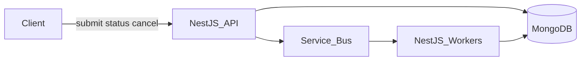

# Async job processing system

Makai Labs async technical exercise. Architecture only, not an implementation.

Accept jobs over HTTP (seconds to minutes), run them in the background, retry failures, let the caller read status, notify on done/fail, and cancel work that has already started. Volume is high and spiky.

**Stack.** NestJS, Azure Service Bus, MongoDB. That is the whole core: an API, a queue, a job document.

Details (state machine, API, sequences) are in [ARCHITECTURE.md](ARCHITECTURE.md).

## Assumptions

- Multi-tenant SaaS. The caller is already authenticated; jobs are scoped to a tenant.
- A job is a machine-run unit of work: a type plus a payload. Large payloads go in blob storage; the queue message is just `jobId`.
- At-least-once delivery. Workers are idempotent. No exactly-once.
- Cancel is cooperative. The worker checks a field on the job document. We do not kill the process or pull a locked Service Bus message.
- Notification is an HTTPS webhook passed in at submit time.
- Azure (AKS, Service Bus, MongoDB via Cosmos DB Mongo API).

## High-level architecture

Three moving parts. The API never runs the job. It writes a document, puts a message on the bus, and returns `202`. Workers compete for messages. MongoDB is the record of what happened: status, attempts, cancel, and the webhook outbox.

Happy path:

1. `POST /jobs` inserts `queued`, enqueues `jobId`, returns `202`.
2. A worker peek-locks the message, sets the document to `running`, runs the handler, sets `succeeded` (or retries / fails).
3. That same status write inserts an outbox document. A small dispatcher POSTs the webhook.

Spikes sit on Service Bus. Workers scale on queue depth (KEDA). If the queue or a tenant is over a cap, submit returns `429` instead of taking unbounded work.

## Major components

**Job API (NestJS).** Submit, get status, cancel. Auth, validation, tenant checks. Write the document first, then enqueue. If enqueue fails, a sweeper re-enqueues leftover `queued` jobs.

**MongoDB.** One document in `jobs` is the source of truth: status, attempt, payload pointer, `cancelRequestedAt`, webhook URL. Status moves as `queued → running → succeeded | failed | cancelled`. Updates are conditional (`findOneAndUpdate` with `status: expected`) so two workers cannot start the same job. An `outbox` collection is written in the same transaction as a terminal status so we do not succeed a job and forget to notify.

**Azure Service Bus.** The spike buffer. Peek-lock, max delivery count, dead-letter queue, duplicate detection, scheduled messages for backoff. One queue to start.

**Workers (NestJS, same codebase, second process).** Pull from the bus. Skip the job if it is already terminal or cancel was requested. Run the handler. Complete the message when done. Check `cancelRequestedAt` between steps and on lock renewal.

**Webhook dispatcher.** Reads the outbox, POSTs, retries. The job is already terminal; a down webhook does not re-run work. Clients can always `GET /jobs/:id`.

## Hardest problems

### 1. Cancel while the worker already holds the lock

Service Bus cannot take a locked message back. Killing the pod is worse: the lock expires, the message comes back, and you may run cancelled work.

Cancel writes `cancelRequestedAt` on the document. If the job is still queued, the worker sees the flag, marks `cancelled`, completes the message, and does not run. If it is running, the handler checks the flag between steps and does the same. If it is already done, return `409`.

A job may finish the current step after cancel is requested. That is the contract.

### 2. Spikes and noisy-neighbor tenants

The bus is a buffer, not an infinite one.

1. Scale workers on queue depth, with a max replica count so we do not melt MongoDB or downstream APIs.
2. Reject submit with `429` + `Retry-After` when global depth or that tenant's open jobs exceed a cap.
3. Cap in-flight jobs per worker pod so one slow handler type cannot pin a replica.

### 3. Retries without double-applying, and status that is actually queryable

The same job can run twice (lock timeout, duplicate enqueue). Idempotent handlers, not hope, are the fix.

- Retryable errors (timeouts, 503): increment `attempt`, schedule the next message with backoff, complete the current one, leave status `queued`.
- Permanent errors or max attempts: `failed`. Do not use the dead-letter queue as a bucket for expected business failures.
- Conditional status updates plus Service Bus duplicate detection (message id `jobId:attempt`) stop two workers from both "starting" the same attempt.
- Status is `GET /jobs/:id` against MongoDB. For a single job that is enough. If status traffic later dwarfs writes, add a cache then — not on day one.

The webhook is independent of the worker: outbox commits with the terminal status, dispatcher retries without re-running the job.

## What I would not do yet

- Extra stores (Redis, a second queue) until MongoDB status reads or cancel checks are actually hot.
- A workflow engine. This prompt is submit / run / retry / status / cancel, which a queue plus a job collection covers.
- Kafka, or one queue per job type, until SLAs or volume force it.

Build the job collection and the queue first. Everything else is a scaling add-on you can name when asked, not something you have to operate in v1.
